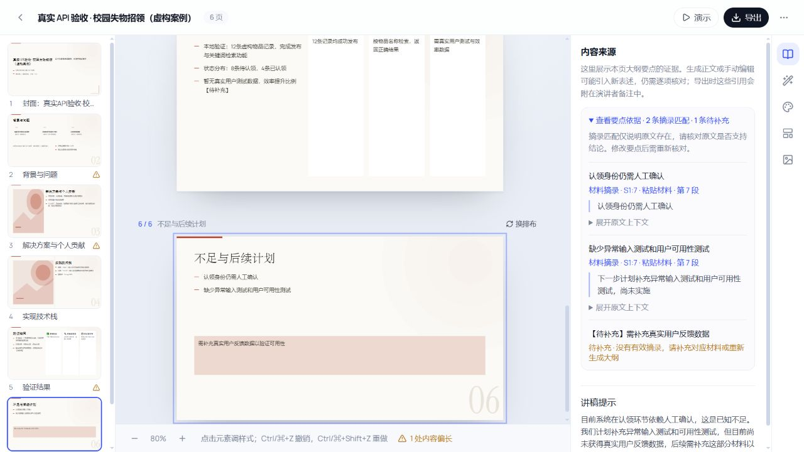

# NarrativePPT · Audience-aware AI presentations

**Start with the audience. Plan the story. Keep the evidence visible.**

A personal AI product designed and maintained by [BStronger1](https://github.com/BStronger1).
[中文](README.md) · [Output preview](https://bstronger1.github.io/narrative-ppt/) · [Design story (Chinese)](docs/PRODUCT_STORY.md) · [Engineering notes](docs/ENGINEERING_STORY.md)


Turn source material into a narrative plan, reviewable outline and editable PPTX with speaker notes. Six audience presets help shape the communication goal, knowledge level and presentation length. Users can bring an OpenAI-compatible model and their own API key.

## See the output first

No account or API key is needed to [view screenshots and sample text](https://bstronger1.github.io/narrative-ppt/).
Download real model outputs: [5 slides](examples/deepseek-fixed-20261006/5-pages.pptx) · [10 slides](examples/deepseek-fixed-20261006/10-pages.pptx) · [15 slides](examples/deepseek-fixed-20261006/15-pages.pptx) · [20 slides](examples/deepseek-fixed-20261006/20-pages.pptx).

The preview is static. Live generation requires a local deployment and model credentials. A local demo mode works without a model key.



## What I focused on

- **Audience-aware planning:** cognitive load, multimedia learning and ELM inform the design prompts, narrative plan, page roles and timing. They are design references; no audience-outcome experiment has been conducted.
- **Evidence handling:** source excerpts, reference validation, and explicit inference / missing-evidence labels. This is not semantic fact-checking or RAG.
- **Reliable long outlines:** global structure first, then batches of up to five pages with two concurrent requests, schema checks and one local retry for invalid batches.
- **Personal model settings:** per-account model configuration with encrypted API keys.
- **Verifiable delivery:** real PPTX artifacts, regression tests, CI and deployment documentation.

LangGraph coordinates workflow stages; LangChain handles model calls and Pydantic validates structured output. Redis / ARQ run background jobs. The application uses FastAPI, React / TypeScript, PostgreSQL and python-pptx.

## Validation

On 2026-10-06, `DMXAPI-deepseek-v4-flash` completed 5, 10, 15 and 20-slide runs using the same fictional input. Exported files were read back to verify slide count, editable text and notes. Quality warnings remained: 3, 7, 8 and 14 respectively.

The corresponding local backend regression run reported **442 passed / 3 skipped**, including existing and new tests (skips are font-dependent checks). This is one case per length, not a success-rate benchmark, load test or guarantee of factual accuracy.

Read [the failure history and fixes](docs/LONG_OUTLINE_FIX.md).

## Run locally

Requirements: Python 3.12+, Node.js 22.22+, Docker and uv for manual setup.

```bash
git clone https://github.com/BStronger1/narrative-ppt.git
cd narrative-ppt
```

On Windows, start Docker Desktop and run:

```powershell
powershell -ExecutionPolicy Bypass -File ./scripts/start.ps1 -Demo
```

Open http://127.0.0.1:39800 and register a local account. Demo mode does not call a model. See the [Chinese setup guide](README.md#快速运行) for manual startup and real model configuration, or the [deployment guide](docs/DEPLOYMENT.md).

## Feedback

[Share a concrete use case](https://github.com/BStronger1/narrative-ppt/issues/new?template=use_case.yml) or [report a reproducible bug](https://github.com/BStronger1/narrative-ppt/issues/new?template=bug_report.yml). Use public or fictional materials and never include credentials.

If useful, star the repository to find it again. [Contributing](CONTRIBUTING.md) · [Security](SECURITY.md) · [Code provenance and rights](docs/NOTICE.md).
