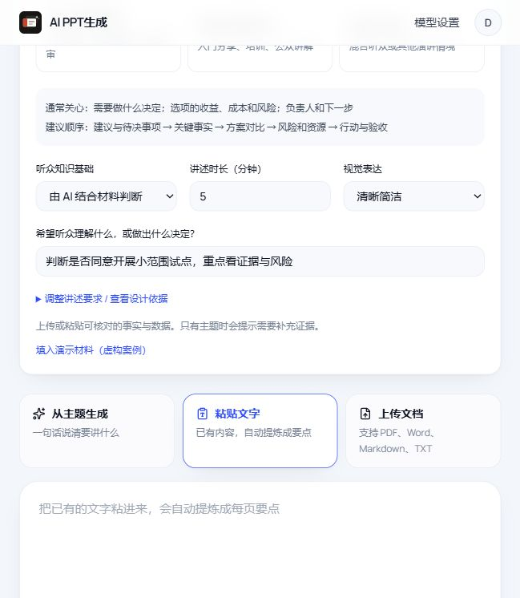
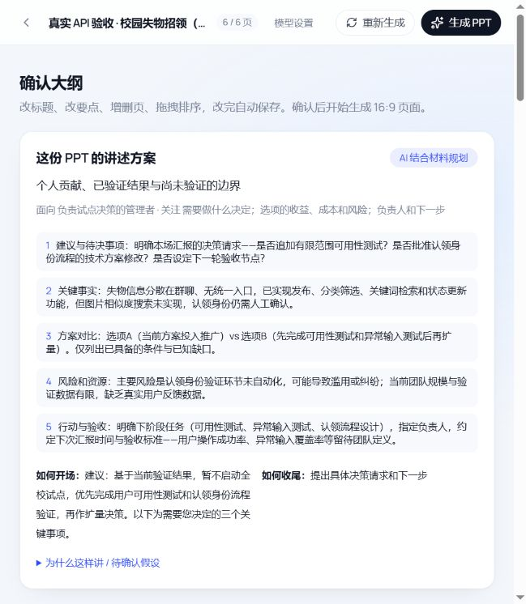

<div align="center">


# NarrativePPT · AI PPT生成

**先理解听众，再组织叙事，让每一页都有依据。**

由 [BStronger1](https://github.com/BStronger1) 设计与维护的个人 AI 产品项目

[](https://github.com/BStronger1/narrative-ppt/actions/workflows/ci.yml)


[免登录成果预览](https://bstronger1.github.io/narrative-ppt/) · [快速运行](#快速运行) · [心理学设计故事](docs/PRODUCT_STORY.md) · [English](README.en.md)

</div>

NarrativePPT 把项目材料转成适合具体听众的演示文稿。选择听众与沟通目标，上传材料，审阅 AI 叙事和可追溯大纲，再生成、编辑并导出原生 PPTX。适用于项目答辩、技术分享、管理汇报和教学讲解。

## 先看它解决什么问题

同一份材料，给评审讲需要论据与边界，给技术同行讲需要实现与取舍。NarrativePPT 参考认知负荷理论、多媒体学习原则与 ELM，把听众、知识基础、目标和时长转化为 Prompt 与叙事计划的设计约束；生成后保留编辑和来源审阅环节。理论用于指导设计，尚未开展听众效果实验。

- **先看成果：** [打开免登录预览页](https://bstronger1.github.io/narrative-ppt/)，浏览真实截图和 PPTX 原文摘录，下载 5 / 10 / 15 / 20 页样例。预览为静态展示，不调用模型。
- **了解设计：** [从心理学设计到 LLM 工作流](docs/PRODUCT_STORY.md)，从师兄的听众建议出发，讲清三个理论如何对应产品行为。
- **再看实现：** [5 页能生成，20 页却超时：一次 LLM 工作流修复](docs/ENGINEERING_STORY.md)，讲清分批、结构校验、局部重试和超时预算的取舍。
- **带着问题试用：** [提交听众场景与使用反馈](https://github.com/BStronger1/narrative-ppt/issues/new?template=use_case.yml)。觉得有用，可以 Star 留作下次使用。

## 产品演示


<table>
<tr><th>01 · 先确认听众与目标</th><th>02 · 审阅全篇讲述方案</th></tr>
<tr>
<td></td>
<td></td>
</tr>
</table>

截图来自虚构测试案例。维护者确认系统已部署并在课题组中使用；服务位于受限网络，未提供公共在线生成地址，课题组使用尚无量化效果报告。可在本地使用演示模式，或下载真实生成的 [5 页](examples/deepseek-fixed-20261006/5-pages.pptx)、[10 页](examples/deepseek-fixed-20261006/10-pages.pptx)、[15 页](examples/deepseek-fixed-20261006/15-pages.pptx)、[20 页 PPTX](examples/deepseek-fixed-20261006/20-pages.pptx)。

## 我重点完成的产品与工程设计

| 设计方向 | 用户获得什么 | 实现与证据 |
|---|---|---|
| **面向听众的叙事规划** | 为评审、管理者、同行、投资/业务、教学或自定义听众调整讲述方式 | 六类预设、AI 叙事方案、逐页角色、用时和衔接；[设计记录](docs/NARRATIVE_DESIGN.md) |
| **材料与结论可追溯** | 查看原文，区分材料、推断与待补充 | 摘录校验、无效引用降级、输入指纹、来源与讲述备注导出；[证据设计](docs/DESIGN.md) |
| **用户自己的模型与密钥** | 选择模型、填写自己的 API Key、验证连接、随时删除 | 账号隔离、密钥加密、服务地址限制、按项目所有者解析配置 |
| **长篇生成的可靠性** | 分批生成，多页任务有明确失败反馈 | 全篇页序 → 最多 5 页一批 → 2 批并发 → 失败批次局部重生成；[故障修复与复测](docs/LONG_OUTLINE_FIX.md) |
| **可运行、可验收的交付** | 无密钥体验完整流程，下载真实模型样例 | Windows 启动、Linux 用户目录部署、回归测试与四档真实 API 验收 |

完整功能包括文档输入、可编辑大纲、异步逐页生成、SSE 进度、在线编辑、主题与版式切换、质量检查，以及原生可编辑 PPTX 导出。代码来源与权利记录见 [NOTICE](docs/NOTICE.md)。

## 工程设计


**React / TypeScript → FastAPI → PostgreSQL / Redis → ARQ → LangChain / LangGraph → python-pptx**

- 前端与导出复用 `shared/` 中的主题和布局数据，领域内容与渲染分离。
- 长大纲先确定整体结构，再补充小批次内容；批次完成顺序不会改变最终页序。
- 模型读取等待 180 秒，单次大纲工作流预算 600 秒，在后台硬超时前写入终态。结构错误局部重生成，鉴权错误不重复尝试。
- 来源校验与质量告警保留不确定性，不把“可导出”当作“内容一定正确”。

## 真实测试

2026-10-06，`DMXAPI-deepseek-v4-flash`，同一份虚构材料、学术听众、四档页数。每档一轮观测，包含实际模型调用。

| 请求页数 | 大纲 | 正文 | 完成页数 | PPTX 回读 | 质量提示 |
|---:|---:|---:|---:|---|---:|
| 5 | 70.37 s | 42.26 s | 5 / 5 | 通过 | 3 |
| 10 | 82.37 s | 60.39 s | 10 / 10 | 通过 | 7 |
| 15 | 112.49 s | 72.47 s | 15 / 15 | 通过 | 8 |
| 20 | 140.62 s | 92.68 s | 20 / 20 | 通过 | 14 |

同版后端回归：**442 passed / 3 skipped**，包含既有与新增测试。跳过项为本地缺少度量字体的精确路径检查。独立回读确认页数、每页可编辑文字、来源/讲述备注和时间预算。历史失败及修复过程保留在 [验收记录](docs/VALIDATION.md)，不将单案例结果包装成成功率或性能 SLA。

## 快速运行

需要 Python 3.12+、Node.js 22.22+ 和 Docker。首先克隆：

```bash
git clone https://github.com/BStronger1/narrative-ppt.git
cd narrative-ppt
```

### Windows：无密钥体验

启动 Docker Desktop 后，在项目根目录执行：

```powershell
powershell -ExecutionPolicy Bypass -File ./scripts/start.ps1 -Demo
```

打开 **http://127.0.0.1:39800**，注册本地账号后新建 PPT。演示模式使用规则摘录，不调用模型；可体验大纲、编辑、质量提示和导出。首次安装需要联网，后续可添加 `-SkipInstall`。Ctrl+C 停止应用，`docker compose stop` 停止数据库与队列并保留数据。

### 手动开发

```bash
docker compose up -d --wait
cd backend
cp .env.example .env
uv sync --frozen
uv run alembic upgrade head
uv run uvicorn app.main:app --host 127.0.0.1 --port 39800
```

分别在另外两个终端启动：

```bash
# backend 目录
uv run python scripts/run_worker.py
# frontend 目录
npm ci
npm run dev
```

开发页面：`http://127.0.0.1:39173`；API 文档：`http://127.0.0.1:39800/docs`。无密钥开发时，在 `backend/.env` 设置 `DEMO_MODE=true` 后启动 API 和 worker。

### 使用真实模型

在已被忽略的 `backend/.env` 中配置并重启 API / worker：

```dotenv
DEMO_MODE=false
LLM_BASE_URL=https://api.deepseek.com
LLM_MODEL=你的账号可用模型名称
LLM_API_KEY=你的密钥
LLM_TIMEOUT_SECONDS=180
```

支持 OpenAI 兼容、能返回 JSON 的模型接口，不同模型需分别验证。登录后的“模型设置”支持用户自己的模型和 API Key；个人设置按账号隔离，密钥加密且不会回显。允许的服务域名由 `MODEL_API_ALLOWED_HOSTS` 管理。`MODEL_CONFIG_SECRET` 需稳定保管，变更会影响已有密钥解密。图片服务为可选能力。

## 开发与验证

```bash
# 先启动 PostgreSQL / Redis 并完成迁移
cd backend
uv run pytest -q
uv run ruff check app tests
cd ../frontend
npm run build
npm run lint
```

常规测试不调用真实模型。手动真实 API 验收会消耗额度：

```bash
cd backend
uv run python scripts/test_page_counts.py --url http://127.0.0.1:39800 --model DMXAPI-deepseek-v4-flash --output-dir var/live-validation/new-run
```

目录必须是新目录，以保留每次结果。更多信息见 [部署说明](docs/DEPLOYMENT.md)、[贡献指南](CONTRIBUTING.md) 和 [安全说明](SECURITY.md)。

## 项目边界

引用匹配只证明摘录存在，不证明原文支持结论；正文扩写和人工修改仍需复核。心理学原则是叙事设计参考，未开展听众效果实验。尚未实现 OCR、语义检索或逐句事实核验；没有并发压测或跨 PowerPoint/WPS 的完整人工视觉验收。生成样例保留质量提示，建议打开文件检查后使用。

---

**Maintained by [BStronger1](https://github.com/BStronger1)** · [个人主页](https://bstronger1.github.io/cv/) · [代码来源与权利记录](docs/NOTICE.md)
